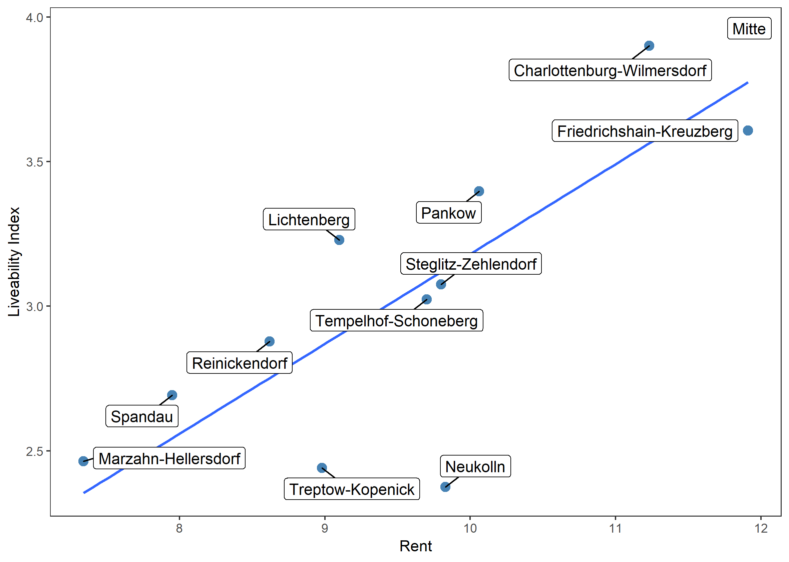

# Visualization of results
## Heatmaps

The Analysis framework was based on the data for 12 Berlin districts:


Within this section we are going to answer 2 questions: 
1) How is the liveability of the district connected to the average rent in the district?
2) Which districts are overpriced and which ones are underpriced?
3) If there still a difference among East and West parts of Berlin as it used to be in the past?

In order to answer those questions, we performed visual analysis and applied some basic statistical concepts, such as correlation analysis, linear regression analysis and tested difference in means for two groups. 

The graph above was ploted by means of ggmap and ggplot2 using data from the following sources: 
 - Stamen maps
 - Polygons with district borders: 
https://data.technologiestiftung-berlin.de/dataset/bezirksgrenzen 

```{r chunck_9, echo=TRUE, tidy=TRUE}
# Download map-teils from Stamen Maps
map = get_stamenmap(ber_adj, maptype="toner-lite", zoom = 11)

# Download polygons with districts borders
test = readOGR("./06_Results_Visualization/bezirksgrenzen.kml")
Bezirk = fortify(test)

# Merge Index and Rent Data with District borders (Used in next graphs)
IndRntDt = Bezirk %>% 
    merge(IndDt, by = "District") %>%
    merge(RntDt, by = "District")

# Plot the 
p1 <- ggmap(map, extent = "normal", maprange = FALSE) +  # Map of Berlin
  geom_polygon(data = IndRntDt,                          # District borders
               aes(long, lat, group = group, fill=District),
               colour = "darkcyan", 
               alpha = 0.2) + 
  theme_bw() +
  coord_map(projection="mercator",
            xlim = c(attr(map, "bb")$ll.lon, attr(map, "bb")$ur.lon),
            ylim = c(attr(map, "bb")$ll.lat, attr(map, "bb")$ur.lat))

print(p1)
```

## Analysis Rent vs. Liveability Index

According to *somebody said* lately Berlin had one of the highest rates of Rent increase among other German cities. It is no more cheap and at the same time every year more and more attractive for live as well as for tourism. The graph below shows the distribution of rent per sq.m. over 12 districts together with calculated liveability index. 


The graph was generated using the following script:

```{r RentIndex, echo=TRUE, tidy=TRUE}
# Plot liveability Index heatmap with rent labeled on it
p2 = ggplot(IndRntDt,  # Plot districts
           aes(long, lat, group = group))+
  geom_polygon(aes(fill = TotalIn),   # Color polygons according to index value
               colour = "bisque4")+   # Color of the border
  scale_fill_gradient(low = "snow1",  # Set color gradient scale
                      high = "darkcyan",
                      name = "Liveability Index") +
  theme_bw() +
  theme(panel.border = element_blank(),  # No graph border   
        panel.grid.major = element_blank(),  # No grid
        panel.grid.minor = element_blank(),
        axis.line  = element_blank(),
        axis.ticks = element_blank(),
        axis.text  = element_blank(),
        axis.title = element_blank())+
  scale_color_gradient(low = "paleturquoise",  # Set colors for Rent labels
                       high = "rosybrown2", 
                       guide=FALSE) +
  geom_label_repel(data = LablesDt,  # Add district labels
             aes(long, lat, label = District, group = District), 
             size = 3,
             box.padding = 2,
             segment.color = 'grey24') + 
  geom_point(data = LablesDt,  # Add round balls for rent labels
             aes(long, lat, 
                 colour = Rent,
                 group = District),
             size = 13) +
  geom_point(data = LablesDt,  # Add rent balls borders
             aes(long, lat, 
                 group = District),
             size = 13,
             shape = 1,
             colour = "grey24") + 
  geom_text(data = LablesDt,  # Add Rent Numbers
            aes(long, lat, label = paste0(Rent,"€"), group = District), 
            size = 3)

```

The dependence structure of average district rent and the livability index is clearer illustrated on the scatter plot below.



```{r RentIndexScatter, echo=TRUE, tidy=TRUE}

ggplot(LablesDt, aes(x=Rent, y=TotalIn)) +
  geom_point(size = 3, 
             colour = "steelblue") +  # Use hollow circles
  geom_smooth(method = lm,  # Add linear regression line                         
              se = FALSE) +  # Don't add shaded confidence region
  theme_bw()+
  theme(panel.grid.major = element_blank(),
        panel.grid.minor = element_blank()) +
  labs(y = "Liveability Index") +
  geom_label_repel(data = LablesDt, 
                   aes(Rent, TotalIn, label = District, group = District), 
                   size = 4,
                   box.padding = 0.5) 
```
                   

As we can see from the plot above, there is a clear patern of higher rent in districts with higher livabiliry index. Pearson correlation coeffitient between rent and livability index is equal to 0.88. The dependence structure looks linear. According to the summary of linear regression of rent on livability index $R^2$ coefficient is equal to XX. Statistics were calculated with the following R script: 

```{r RentIndex, echo=TRUE, tidy=TRUE}
#calculate correlation between Rent and Total Index
cor(LablesDt$TotalIn, LablesDt$Rent)

#run regression of rent on calculated total index and print regression summary
LablesDt %>% 
  lm(Rent~TotalIn, .) %>%
  summary()
```

It should be mentioned that statistical analysis and validity of its results are highly constrained by the small sample size (12 observations). That is why we rather focus on the visual interpretations of calculated results. 

## East and West Berlin Differences

Last question we wanted to address in our analysis was the difference of historically separated west and east parts of Berlin. If there still any difference in develoment of those two parts? In order to answer this question we plotted heatmap for total index together with historical border of Berlin Wall.

Polygon Data for Berlin Wall was downloaded from: https://opendata-esri-de.opendata.arcgis.com/


The graph does not show any clear dependence between livability and historical separation. To get a full picture we also considered subindexes (physical, social, economic and ecological with regard to historical border)

*Insert 4 graphs* 

As there is no clear dependence, we conclude that all the historical differences we suspected at the beginning of our analysis disappeared during last 30 years (Berlin was united in 1989).

```{r RentIndex, echo=TRUE, tidy=TRUE}
#here will be the function for graphs
```